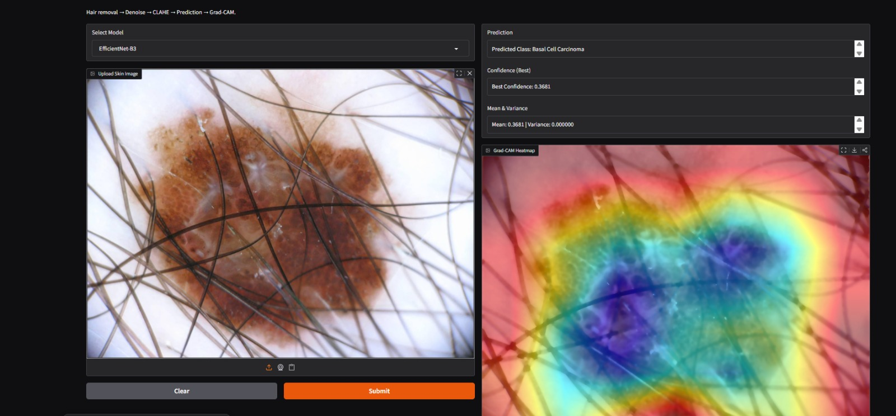
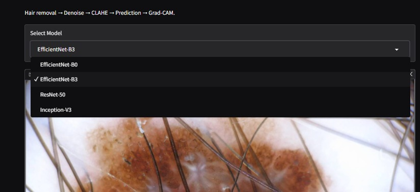
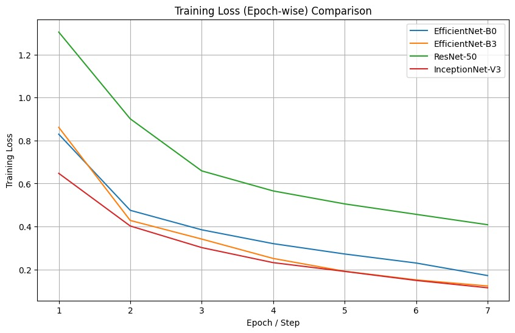
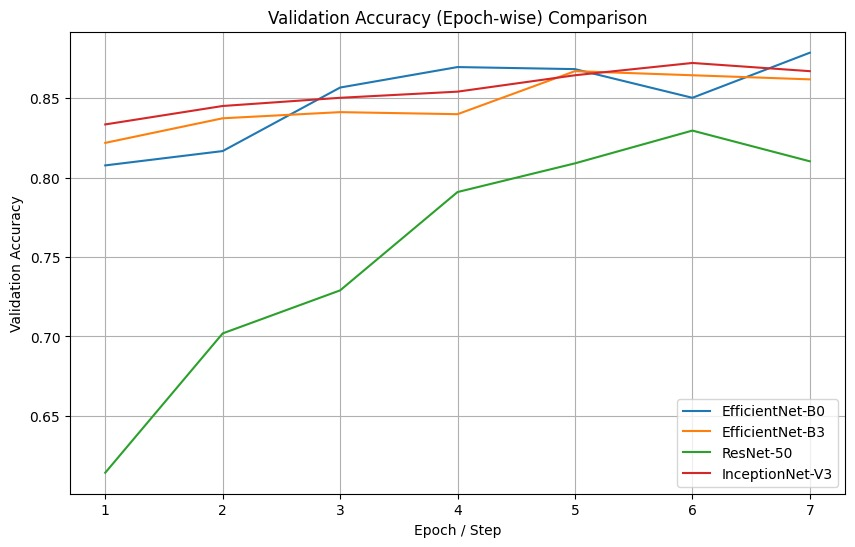
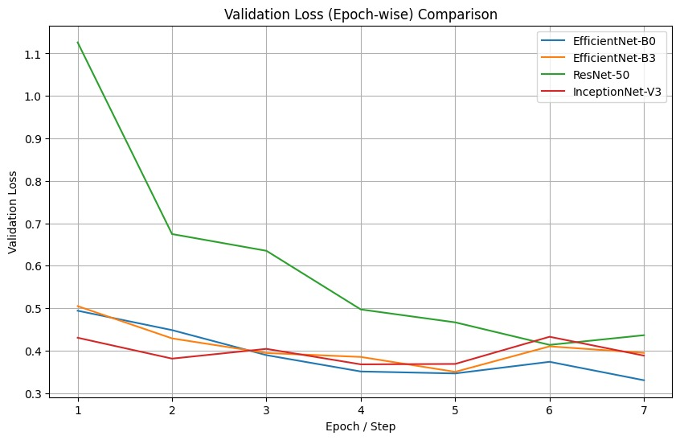

# DermaPal – AI-Powered Skin Disease Classification with Explainability

DermaPal is an AI-powered skin disease analysis system designed to assist in early-stage dermatological screening.  
It leverages fine-tuned Convolutional Neural Networks (CNNs) to classify skin conditions while emphasizing model interpretability and prediction reliability through **Grad-CAM–based visual explanations** and confidence calibration.

The system generates **Grad-CAM heatmaps** to highlight lesion regions that influence model predictions, alongside classification results and calibrated confidence scores. This combination enables transparent decision-making and makes DermaPal suitable for academic research and AI-assisted clinical decision-support applications.


---

## Table of Contents

- [Project Overview](#project-overview)
- [Features](#features)
- [Datasets Used](#datasets-used)
- [Model Architectures](#model-architectures)
- [System Workflow](#system-workflow)
- [Explainability and Calibration](#explainability-and-calibration)
- [Installation](#installation)
- [Usage](#usage)
- [Results and Model Evaluation](#results-and-model-evaluation)
- [Technology Stack](#technology-stack)
- [Future Enhancements](#future-enhancements)
- [Disclaimer](#disclaimer)

---

## Project Overview

DermaPal aims to address key challenges in automated skin disease classification, including visual similarity between skin conditions, the black-box nature of deep learning models, and overconfident or unreliable predictions.

To overcome these challenges, the system integrates multiple fine-tuned CNN architectures, Grad-CAM based explainability, and confidence calibration techniques. The primary goal is to develop a system that balances predictive accuracy with interpretability and reliability, which are critical in medical AI applications.

---

## Features

- Automated skin disease classification using CNNs  
- Comparative analysis across multiple deep learning architectures  
- Grad-CAM based heatmap visualizations for interpretability  
- Training and validation performance analysis  
- Confidence calibration for reliable prediction probabilities  
- Optional interactive interface for model inference  

---

## Datasets Used

The system is trained and evaluated using publicly available dermatological image datasets:

- ISIC Skin Lesion Dataset  
- HAM10000 Dataset  

These datasets consist of labeled dermatoscopic images covering a wide range of skin disease categories.

---

## Model Architectures

The following pretrained convolutional neural network architectures were fine-tuned and evaluated:

- EfficientNet-B0  
- EfficientNet-B3  
- ResNet-50  
- InceptionNet-V3  

All models were trained using an identical preprocessing, training, and evaluation pipeline to ensure a fair and consistent comparison.

---

## System Workflow

1. The user provides a dermatoscopic skin image as input  
2. Image preprocessing is applied, including resizing, normalization, and augmentation  
3. The processed image is passed through a selected CNN model for classification  
4. Confidence calibration is applied to prediction probabilities  
5. Grad-CAM heatmaps are generated to explain model predictions  
6. The final output includes:
   - Predicted skin disease class  
   - Confidence score  
   - Heatmap-based visual explanation  

---

## Explainability and Calibration

### Grad-CAM Heatmap Visualization

The following example demonstrates the Grad-CAM output generated by the system. The heatmap highlights lesion regions that influenced the model’s prediction, enabling visual interpretability and clinical insight.



### Explainability

Grad-CAM is used to generate heatmaps that highlight regions of the input image contributing most to the model’s prediction. This enables visual verification that the model focuses on clinically relevant lesion areas rather than background artifacts.

Screenshots of Grad-CAM heatmaps should be placed in the `screenshots` directory and referenced here.

### Confidence Calibration

Confidence calibration techniques are applied to align predicted probabilities with actual correctness. This reduces overconfidence in incorrect predictions and improves the trustworthiness of model outputs, which is particularly important in healthcare-related applications.

---
## Installation

### Using Conda (Recommended)

DermaPal was developed and tested using a Conda environment.  
It is recommended to create and activate a Conda environment before installing dependencies.

The current project was built with **python version 3.12**

```bash
conda create -n derm python=3.12 
conda activate derm
```

Clone the repository and install the required dependencies.

```bash
git clone https://github.com/Amith0707/DermaPal.git
cd DermaPal
pip install -r requirements.txt
```
---
## Usage

DermaPal provides an interactive Gradio-based interface for performing skin disease classification with explainability.

### Running the Gradio Application

The main application entry point launches a Gradio interface that allows users to:
- Select a trained CNN model
- Upload a skin lesion image
- View the predicted class
- Inspect calibrated confidence scores
- Visualize Grad-CAM heatmaps highlighting important regions

To launch the application:

```bash
python -m gradio_app.app
```
Once started, the interface will be accessible in the browser at a local URL provided by Gradio.

### Model Selection Interface

The application provides a dropdown-based interface that allows users to select from multiple fine-tuned CNN architectures used in the project. This enables direct comparison of model behavior during inference.




### Model Weights Configuration
Fine-tuned model weights are expected to be located in the following directory:

```bash
ai/weights/
```
The application loads model checkpoints from this folder:

```bash
ai/weights/
 ├── efficientnet_b0_best.pth
 ├── efficientnet_b3_best.pth
 ├── resnet50_best.pth
 └── inception_v3_best.pth
```

**Note:** Due to file size constraints, trained model weights are not included in the repository by default.

To run the application successfully, users must either:
   -Train the models locally using the provided training scripts, or
   -Place their own compatible model checkpoints inside the ai/weights/ directory following the naming convention above.

If the weights are missing, the application will not run inference and will raise a loading error.

### Inference Pipeline

During inference, the system performs the following steps:

1. Image preprocessing (hair removal, denoising, and contrast enhancement)

2. CNN-based classification using selected model

3. Confidence calibration to reduce overconfident predictions

4. Grad-CAM heatmap generation for explainability

The final output includes:

*  Predicted skin disease class

*  Best confidence score

*  Mean confidence and variance

*  Grad-CAM heatmap visualization

### Device Support

By default, inference is executed on CPU:

```bash
device="cpu"
```

---
## Results and Model Evaluation

To evaluate the effectiveness of the proposed system, all four CNN architectures were fine-tuned and compared using identical experimental settings. Performance was assessed using training loss, validation loss, and validation accuracy across epochs.

#### Training Loss Comparision

This plot compares the training loss of all models over epochs and highlights convergence behavior.




#### Validation Accuracy Comparison

The validation accuracy comparison highlights differences in learning behavior and stability across architectures.  
EfficientNet-based models demonstrate more consistent accuracy trends across epochs.






#### Observations

- All fine-tuned models achieved stable convergence during training.
- EfficientNet variants showed faster convergence and better generalization behavior.
- Grad-CAM heatmaps confirmed that predictions were driven by lesion regions rather than background noise.
- Confidence calibration improved reliability by reducing overconfident incorrect predictions.

---

## Technology Stack

- Programming Language: Python 3.12  
- Deep Learning Framework: PyTorch  
- Model Architectures: EfficientNet-B0, EfficientNet-B3, ResNet-50, InceptionNet-V3  
- Explainability: Grad-CAM  
- Visualization: Matplotlib  
- Interface: Gradio  
- Environment Management: Conda  
- Datasets: ISIC, HAM10000  

---
## Future Enhancements

- Integration of multimodal inputs such as patient symptoms and metadata
- Expansion to larger and more diverse dermatological datasets
- Clinical validation with dermatologists
- Deployment as a web-based or mobile decision-support system
- Optimization for GPU-based inference

---

## Disclaimer

This project is intended strictly for academic and research purposes.  
It is not a substitute for professional medical diagnosis, treatment, or clinical decision-making.
